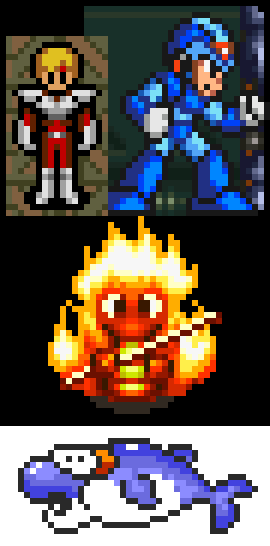

Kopf-Lischinski "Depixelizing Pixel Art" Node.js version
=======================

Based on the following paper:
* [Depixelizing Pixel Art](https://johanneskopf.de/publications/pixelart/)
And the [source code](https://github.com/falichs/Depixelizing-Pixel-Art-on-GPUs) included with this paper:
* [Depixelizing Pixel Art on GPUs](https://www.cg.tuwien.ac.at/research/publications/2014/KREUZER-2014-DPA/)

Notes
* Original GPU code is MIT licensed, the same license may apply here, all original code in this project is additionally released under the MIT License
* Most GPU code semi-automatically converted to JavaScript by Codex (AI)
* Example below is expanded to 12x via Depixel and then shrunk by 2x with linear filtering (e.g. 2xAA)



## API
```ts
type Image = {
  data: Buffer; // Or Uint8Array - pixels in RGBA byte order
  width: number;
  height: number;
};

type Opts = {
  height: number;
  threshold?: number; // 0..255, lower = fewer similarity edges
  borderPx?: number; // pad input with this many pixels (1-2) - useful with `threshold=0` for complete hard edges
}

function scaleImage(src: Image, opts: Opts): Image;
```

## Example usage

```js
const { scaleImage } = require('depixel');

let src = new Uint32Array([
  // White on black "x"
  0xFFFFFFFF, 0x000000FF, 0xFFFFFFFF,
  0x000000FF, 0xFFFFFFFF, 0x000000FF,
  0xFFFFFFFF, 0x000000FF, 0xFFFFFFFF,
]);

let result = scaleImage({
  data: src,
  width: 3,
  height: 3,
}, {
  height: 3 * 6,
});
```

See [test/test.js](test/test.js) for an example including reading and writing from a PNG file.

## Links

* https://johanneskopf.de/publications/pixelart/
* https://github.com/falichs/Depixelizing-Pixel-Art-on-GPUs
* https://www.cg.tuwien.ac.at/research/publications/2014/KREUZER-2014-DPA/
